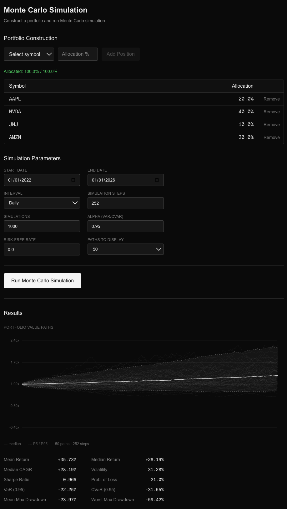
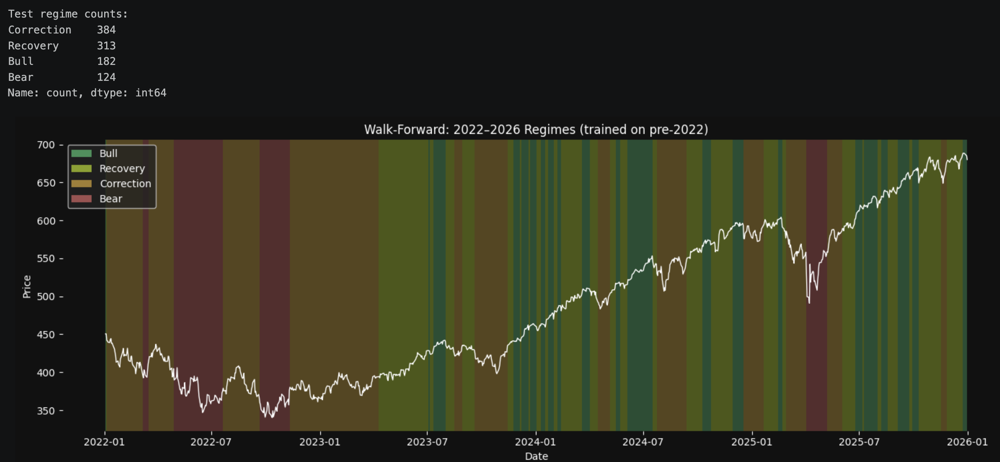
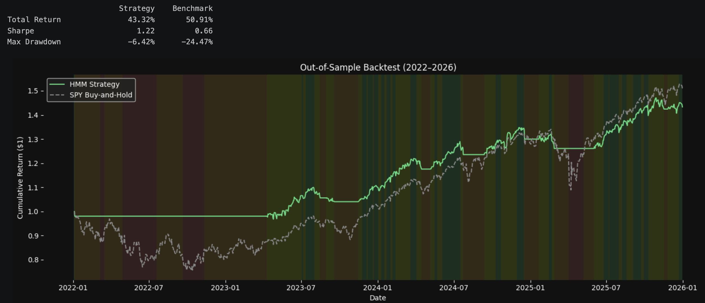

# Sentinel

A DAG-based quantitative research platform for building and testing flexible research workflows across derivatives, ML, stat arb, order flow, simulation, and realistic backtesting.



## What is Sentinel

Sentinel is a graph-based quant research and strategy engineering platform. Instead of separate tools for each quant domain, it provides a unified architecture where all research workflows are composed from reusable computational nodes, executed through DAG orchestration, and evaluated under realistic trading assumptions.

## Current State

**Working MVP — Monte Carlo GBM simulation:** portfolio construction UI, async FastAPI job queue, Celery workers, modular compute engine, SVG visualization with confidence bands and risk metrics.

**Active research — HMM regime detection:** 4-state Hidden Markov Model on SPY, walk-forward validation, out-of-sample backtest against buy-and-hold (see [Research](#research)).

The DAG execution engine is the target architecture but not yet implemented. Engine modules are structured as independent functions with typed inputs/outputs, ready for DAG integration.

## Stack

| Layer | Technology |
|---|---|
| API | FastAPI + Pydantic |
| Async jobs | Celery + Redis broker |
| Frontend | Next.js 16, React 19, Tailwind v4 |
| Compute | NumPy, Pandas, hmmlearn, custom Python modules |
| Caching | Redis |
| Data | yfinance |
| Deployment | Docker + docker-compose |

## Project Structure

```
sentinel/
├── backend/
│   ├── api/          # FastAPI server + Pydantic schemas (async /jobs endpoints)
│   ├── engine/       # Pure computation modules (data, estimation, GBM, portfolio, projection, risk)
│   ├── pipelines/    # Orchestration (simulation runner)
│   ├── services/     # Shared services (Redis cache)
│   ├── tasks/        # Celery task definitions
│   └── celery.py     # Celery app config
├── web/              # Next.js frontend
│   └── app/monte-carlo/   # Monte Carlo page + PathChart
├── research/         # Jupyter notebooks
│   ├── monte_carlo.ipynb
│   └── hmm.ipynb
├── docs/
│   ├── PROJECT.md         # Vision, research domains, north star
│   ├── ARCHITECTURE.md    # Stack, layers, DAG design
│   ├── DECISIONS.md       # Key choices and trade-offs
│   ├── ROADMAP.md         # What's done, what's next
│   └── specs/             # Research specs (HMM, Celery integration)
├── docker-compose.yml
├── Dockerfile
├── CLAUDE.md
└── README.md
```

## Research

### HMM Regime Detection

4-state Gaussian HMM (Bull / Recovery / Correction / Bear) fit on SPY daily features (log returns, 20-day rolling volatility, 60-day drawdown). Parameters grounded in Guidolin & Timmermann (2007) and related literature.



**Walk-forward backtest (2022–2026, out-of-sample):** regime signal drives a binary long/cash position on SPY. Fit on 2016–2021, evaluated on unseen 2022–2026 data.



- Full analysis: [`research/hmm.ipynb`](research/hmm.ipynb)
- Research spec (literature review, feature rationale, failure modes): [`docs/specs/hmm-regime-detection.md`](docs/specs/hmm-regime-detection.md)

### Monte Carlo Exploration

Prototype notebook backing the Monte Carlo engine — parameter estimation, GBM paths, projection sampling.

- [`research/monte_carlo.ipynb`](research/monte_carlo.ipynb)

## Running Locally

**Prerequisites:** [Docker](https://docs.docker.com/get-docker/) and [Node.js](https://nodejs.org) 20+. For the manual path, also Python 3.13+ and [Redis](https://redis.io/docs/latest/operate/oss_and_stack/install/). Works on macOS, Linux, and Windows.

**Docker (recommended):**

```bash
docker compose up
# API on :8000, Redis on :6379, Celery worker in its own container
```

Then start the frontend:

```bash
cd web && npm install && npm run dev
```

**Manual:**

```bash
# Redis
redis-server

# API
python -m venv venv && source venv/bin/activate
pip install -r requirements.txt
uvicorn backend.api.main:app --reload

# Celery worker (separate shell)
celery -A backend.celery worker --loglevel=info

# Frontend (separate shell)
cd web && npm install && npm run dev
```

## Documentation

- [Project Vision](docs/PROJECT.md) — what Sentinel is and where it's going
- [Architecture](docs/ARCHITECTURE.md) — stack, system layers, DAG design
- [Decisions](docs/DECISIONS.md) — key technical choices and trade-offs
- [Roadmap](docs/ROADMAP.md) — what's built, what's next
